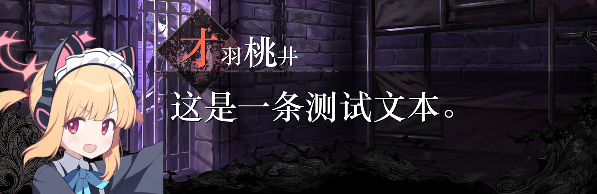

# 🎭 Textbox · 魔女裁判风文本框生成器（TUI + 全局发送）

一个在 Windows 上运行的终端交互（TUI）小工具：
- ✍️ 从剪贴板或当前输入框获取文本/图片
- 🧩 自动排版到魔女裁判风对话框底图上（含角色姓名装饰字）
- 📋 将生成结果写回剪贴板，可选择自动粘贴与发送

---

## ✨ 效果预览



---

## 🚀 亮点特性
- 🖥️ 无依赖 TUI 操作（msvcrt）：
  - ↑ ↓ 切换角色，← → 切换表情，PgUp PgDn 切换背景
  - C 确认角色并预加载缓存（首次该角色必做）
  - 始终显示当前 角色/表情/背景 与 配置状态
- 🔄 全局发送热键：在白名单聊天应用中按下发送键（默认 Enter）
  - 自动执行：全选并剪切 → 生成 → （可选）粘贴 → （可选）发送
- 🧠 多角色与动态表情计数：根据资源目录自动识别“最大编号 n”
- 📝 智能文字排版：
  - 在指定矩形内自适应换行与字号
  - 方括号内文本高亮
  - 角色姓名装饰字：逐字填充（1/2/3 槽各 1 字，第 4 槽为剩余 0+ 字；首字为角色主题色）
- ⚡ 合成缓存：确认角色后一次性生成“背景 × 表情”组合到 cache/，后续生成更快
- 🧪 日志可观测：log.txt 记录生成细节（含文本/图片输入预览）

---

## 🧩 资源目录
项目根目录需有 resource：

```
resource/
  background/
    c1.png ... c16.png                # 背景（数量由 BACKGROUND_NUM 控制）
  character/
    <id>/
      <id> (1).png ... <id> (n).png   # 表情图，n 为最大编号（大小写不敏感）
  font/
    font1.ttf font2.ttf font3.ttf     # 字体（默认 font3.ttf）
```

注意：文件名必须形如“<id> (n).png”，程序以最大 n 为 emotion_count，中间缺号会跳过。

---

## 🔧 安装与启动
- 要求：Windows，Python 3.13+
- 安装依赖：

```bash
pip install -r requirements.txt
```

- 启动（建议管理员权限）：

```bash
python -m src.app
```

---

## 🛠️ 配置
所有配置均在项目根 config/ 下：

### 1) 角色与主题色（config/character.yaml）
```yaml
character:
  momoi:
    name: "才羽桃井"
    color: [255, 105, 80]
    # font: font3.ttf  # 可选
```
- 仅 character 下定义的角色会出现在程序中
- 运行时角色顺序按英文 id（键名）字典序
- 姓名装饰字：slot1=name[0]（主题色），slot2/3/4=白色（第4槽为 name[3:]）

### 2) 运行设置（config/settings.yaml）
```yaml
LOG_LEVEL: DEBUG                 # DEBUG/INFO/WARNING/ERROR/CRITICAL
SEND_HOTKEY: enter               # 全局发送热键（在白名单应用中触发）
AUTO_PASTE_IMAGE: true           # 生成后是否自动粘贴
AUTO_SEND_IMAGE: true            # 粘贴后是否自动发送
WHITELIST: [WeChat.exe, QQ.exe]  # 白名单进程名
ENABLE_WHITELIST: true
BACKGROUND_NUM: 16
TEXT_ST_POS: [728, 355]          # 文本/图片绘制区域（左上）
TEXT_ED_POS: [2339, 800]         # 文本/图片绘制区域（右下）
```

---

## 🕹️ 使用方法
1) 在 TUI 窗口中：
   - ↑ ↓ 切换角色，← → 切换表情，PgUp PgDn 切换背景
   - 按 C 确认角色并预加载（首次该角色必做）
2) 切换到白名单聊天应用的输入框，输入文本或放置图片
3) 直接按发送键（默认 Enter）：
   - 程序拦截该按键并执行：全选并剪切 → 生成 → （可选）粘贴 → （可选）发送
4) 若打开自动粘贴，确保按键作用在聊天输入框；否则结果已在剪贴板，可手动 Ctrl+V 粘贴

---

## 🔍 常见问题
- ❌ 无法从剪贴板获取数据（拒绝访问 5）
  - 可能是剪贴板被占用（剪贴板管理器/云剪贴板/RDP）
  - 解决：稍等再试、以管理员运行、或提高 config 中 DELAY
- ❗ 生成后未粘贴到聊天窗口
  - 自动粘贴只会对当前前台窗口生效；请确保触发时焦点在聊天输入框
- 🧱 资源缺失
  - 检查 resource 目录结构与文件命名是否规范

---

## 🗂️ 目录结构（关键文件）
- src/app.py：主程序（TUI + 全局发送热键）
- src/ui/tui.py：终端 UI（msvcrt 无依赖）
- src/services/*：缓存生成、文本绘制、图片粘贴
- src/config/*：YAML 装载、动态角色信息、路径
- log.txt：运行日志（每次启动覆盖）

---

## 更新日志
### 1.0.0
- 重构了原项目的代码结构
- 使用配置文件统一管理资源
- 支持TUI切换人物、表情、背景

---

## 📜 许可证 & 🙏 致谢
- 许可证：MIT
- 素材版权归原权利人所有，二次创作请遵守相关协议与法律法规
- 灵感与参考：
  - https://github.com/MarkCup-Official/Anan-s-Sketchbook-Chat-Box
  - https://github.com/oplivilqo/manosaba_text_box
